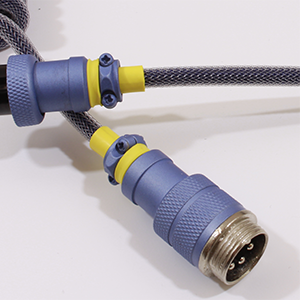
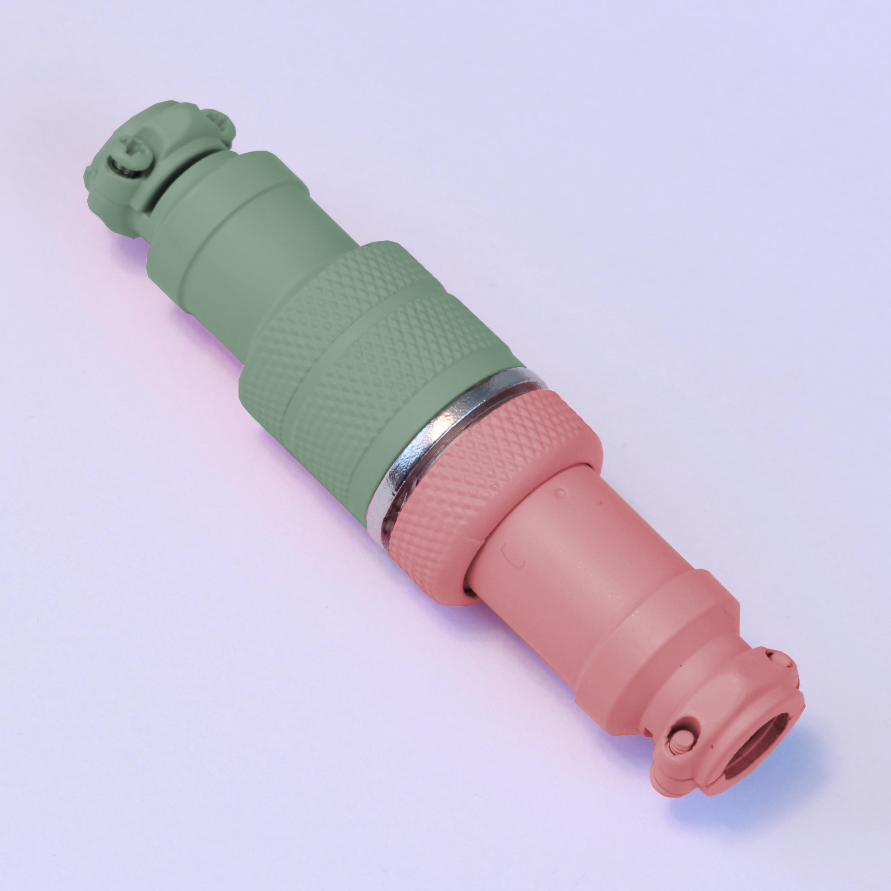
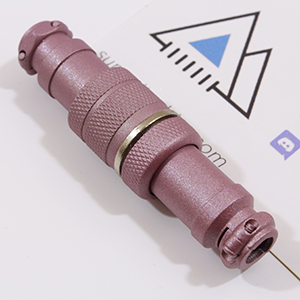
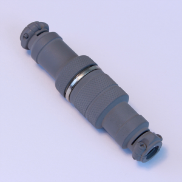

  

<h3 align="center">
  <a href="https://summitcables.com/olivia">Summitcables x Olivia / SE Olivia++</a>
   
  <a href="https://summitcables.com/rudy">Summitcables x Rudy / SE Rudy</a>
   
  <a href="https://summitcables.com/marshmallow">Summitcables x Thic Thock / SE Marshmallow</a>
</h3>

---

<h3 align="center">
  <a href="https://docs.google.com/forms/d/e/1FAIpQLScuu3xz-DcRyDlPHUsZB4gOGa9OdQlIf22b8dJHM9YKLoZjvQ/closedform">Ordering Form / Opens 10:00 AM PT / 12-14-19</a>
   
  <a href="https://summitcables.com/calculator">Price Calculator</a>
</h3>

# Welcome

Hi, welcome to the Summit Catalog v2!

I am based out of Oregon in the United States, and all of my Cable Drops will be in the Pacific time zone.  
You will find all you need to know about Summitcables here, such as information about our available options as well as information about future Group Buys.  
I highly suggest joining the Discord, as you can ask any other questions you might have and interact with our community.  

Thanks!  
-Chris

# Contact Us

* Email: <support@summitcables.com>
* Instagram: <https://instagram.com/summitcables>
* Twitter: <https://twitter.com/summitcables>
* Reddit: <https://reddit.com/u/kbnote>
* Discord: <https://discord.gg/summitcables>

> Summitcables  
> 740 NE 3RD ST  
> STE 3 # 346  
> Bend, OR 97701  
> United States   

# Group Buy Schedule

We are currently taking orders using a Google Form which opens up every Saturday at [10:00 AM PT](https://time.is/PT) located at [this link](https://docs.google.com/forms/d/e/1FAIpQLScuu3xz-DcRyDlPHUsZB4gOGa9OdQlIf22b8dJHM9YKLoZjvQ/closedform).

> Keep in mind that all times are subject to change. In the event of any changes, an announcement will be posted in the Summitcables Discord.

| Dec 14         | Dec 21       | Dec 28       |
|:--------------:|:------------:|:------------:|
| LE Supernova   | LE Nebula R2 | TBA          |
| All options    | All options  | TBA          |
| 50 units       | 50 units     | TBA          |

# Terms of Service

* 3-7 business day turnaround time
* 14 day return policy
* No refunds unless authorized (misorders, rent is due, etc.)

# Table of Contents

1. **[Base](#base)**
2. **[Paracord](#paracord)**
3. **[Techflex](#techflex)**
4. **[Heatshrink](#heatshrink)**
5. **[Host Connector](#host-connector)**
6. **[Device Connector](#device-connector)**
7. **[Coil](#coil)**
8. **[Detachable](#detachable)**
    * **[Aviator](#aviator)**
9. **[Accents](#accents)**
10. **[Themes](#themes)**
11. **[Extra Ends](#extra-ends)**
12. **[Shipping](#shipping)**
13. **[Quality Control](#quality-control)**

## Base[*](#base "Sections indicated by an asterisk are required.")

**Price:** $20.00

Base covers 1 ft of wire and paracord, heatshrink, and silver USB Type A/Mini B/Micro B connectors.

###### | previous section | [return to top](#table-of-contents) | [next section](#paracord) |

## Paracord[*](#paracord "Sections indicated by an asterisk are required.")

**Price:** $0.50 per ft (1 ft included in Base)

Paracord is a lightweight nylon [kernmantle rope](https://en.wikipedia.org/wiki/Kernmantle_rope), which is used to sleeve the cable wire.

|  **Aloha**                                   |  **Apocalypse**                           |  **Banana**                                       |  **Black**                       |
|:---------------------------------------------------------------------------------------------------------:|:-----------------------------------------------------------------------------------------------------------:|:---------------------------------------------------------------------------------------------------------------:|:---------------------------------------------------------------------------------------------:|
|  **Black Widow**                       |  **Baby Blue**                             |  **Blue Blend**                               |  **Blue Carribean**     |
|  **Blue Electric**                   |  **Blue Lite Carolina**           |  **Blue Midnight**                         |  **Blue Royal**             |
|  **Blue Snake**                         |  **Breast Cancer Awareness** |  **Brown Chocolate (Espresso)** |  **Camo Deep Woods**    |
|  **Canary Yellow**                   |  **Canis**                                     |  **Chill**                                         |  **Cotton Candy**         |
|  **Country Girl**                     |  **Coyote Brown**                       |  **Cream**                                         |  **Decay**                       |
|  **Explode**                               |  **Fireball**                               |  **Gecko**                                         |  **Gray**                         |
|  **Home Town Hero**                 |  **Infiltrate**                           |  **Kelly Green**                             |  **Khaki**                       |
|  **Knights Gold and Black** |  **Lifeguard**                             |  **Lightning**                                 |  **Mint Green**             |
|  **Mint Oreo**                           |  **Neon Green**                           |  **Neon Orange**                             |  **Neon Purple Acid** |
|  **Neptune**                               |  **Pink (Pretty in Pink)**       |  **Pink Rose**                                 |  **Purple**                     |
|  **Purple Blend**                     |  **Racing Stripe**                     |  **Reactor**                                     |  **Rebel Camo**             |
|  **Red**                                       |  **Red Imperial**                       |  **Rorschach**                                 |  **Silver Gray**           |
|  **Smores**                                 |  **Snow Camo**                             |  **Spiral Urban**                           |  **Starry Night**         |
|  **Strawberry Fields**           |  **Sugar Rush**                           |  **Tan**                                             |  **Thin Blue Line**     |
|  **Turquoise**                           |  **UFO**                                         |  **White**                                         |  **Zebra**                       |

###### | [previous section](#base) | [return to top](#table-of-contents) | [next section](#techflex) |

## Techflex

**Price:** $1.00 per ft

Techflex, also known as double-sleeving, is a second layer of sleeving which covers the paracord.

|  **Aqua**               |  **Beige**   |  **Black**           |  **Blue**               |
|:-------------------------------------------------:|:---------------------------------------:|:-----------------------------------------------:|:-------------------------------------------------:|
|  **Brown**             |  **Carbon** |  **Clear**           |  **Dark Purple** |
|  **Gray**               |  **Green**   |  **Monochrome** |  **Neon Pink**     |
|  **Neon Yellow** |  **Orange** |  **Purple**         |  **Red**                 |
|  **White**             |                                         |                                                 |                                                   |

###### | [previous section](#paracord) | [return to top](#table-of-contents) | [next section](#heatshrink) |

## Heatshrink[*](#heatshrink "Sections indicated by an asterisk are required.")

**Price:** $0.00 (included in base)

Heatshrinks are shrinkable plastic tubes used around the cable ends and connectors. They are also used in [accents](#accents).

|  **Black**   |  **Blue**                 |  **Brown** |  **Burnt Orange** |
|:-----------------------------------------:|:-----------------------------------------------------:|:---------------------------------------:|:-----------------------------------------------------:|
|  **Clear**   |  **Forest Green** |  **Gray**   |  **Green**               |
|  **Orange** |  **Purple**             |  **Red**     |  **White**               |
|  **Yellow** |                                                       |                                         |                                                       |

###### | [previous section](#techflex) | [return to top](#table-of-contents) | [next section](#host-connector) |

## Host Connector[*](#host-connector "Sections indicated by an asterisk are required.")

**Price:**

| Connector:     | Silver                   | Gold  |
|:---------------|:------------------------:|:-----:|
| USB Type A 2.0 | $0.00 (included in base) | $0.75 |

This connector plugs into your host, i.e. your computer.

###### | [previous section](#heatshrink) | [return to top](#table-of-contents) | [next section](#device-connector) |

## Device Connector[*](#device-connector "Sections indicated by an asterisk are required.")

**Price:**

| Connector:     | Silver                   | Gold  |
|:---------------|:------------------------:|:-----:|
| USB Mini B     | $0.00 (included in base) | $0.75 |
| USB Micro B    | $0.00 (included in base) |   -   |
| USB Type C 2.0 | $2.00                    |   -   |

This connector plugs into your device, i.e. your keyboard or phone.

###### | [previous section](#host-connector) | [return to top](#table-of-contents) | [next section](#coil) |

## Coil

**Price:**

| Coil | Length               | Price |
|:----:|:--------------------:|:------|
| 4 in | Covers 3 ft of cable | $5.00 |
| 5 in | Covers 4 ft of cable | $6.00 |
| 6 in | Covers 5 ft of cable | $7.00 |
| 7 in | Covers 6 ft of cable | $8.00 |
| 8 in | Covers 7 ft of cable | $9.00 |

###### | [previous section](#device-connector) | [return to top](#table-of-contents) | [next section](#detachable) |

## Detachable

**Price:**

| Type:     | Silver | CE     | LE     | SE     |
|:---------:|:------:|:------:|:------:|:------:|
| Aviator   | $11.00 | $20.00 | $20.00 | $20.00 |

Detachable connectors functionally allow for ease and flow when interchanging USB connectors while also preserving the lifespan of your USB cable’s receptacle.

The **Collector’s Edition series**, also known as the **CE-series**, is a range of always in-stock colored detachables. CE detachables will be offered every group buy.

The **Limited Edition series**, also known as the **LE-series**, is a range of very rare colored detachables.

The **Special Edition series**, also known as the **SE-series**, is a range of colored detachables only made through partnerships with vendors within the community.

All colored detachables are unique to and only obtainable through Summitcables.

###### | [previous section](#coil) | [return to top](#table-of-contents) | [next section](#aviator) |

### Aviator

|  **Silver**                       |  **CE Beige**                 |  **CE Blue Gray** |  **CE Crimson Red**       |
|:-----------------------------------------------------------------------------------------------:|:---------------------------------------------------------------------------------------------:|:-------------------------------------------------------------------------------------:|:-----------------------------------------------------------------------------------------------:|
|  **CE Everest White**   |  **CE Gunmetal Gray** |  **CE Hot Pink**   |  **CE Polar Blue**         |
|  **CE Raven Black**       |  **CE Royal Purple**   |  **CE Sakura**       |  **CE Sky Blue**             |
|  **LE 9009**                     |  **LE Dark Matter**     |  **LE Galaxy**       |  **LE Ghost**                   |
|  **LE Glacier**               |  **LE Noir**                   |  **LE Olive**         |  **LE Pink Champagne** |
|  **LE Pink Rose Gold** |  **LE Wild Purple**     |  **LE Yolch**         |  **LE ???**            |

###### | [previous section](#detachable) | [return to top](#table-of-contents) | [next section](#accents) |

## Accents

**Price:** $3.50

Accents are colored stripes made out of heatshrink that are attached to your detachable. Please refer to the [heatshrink section](#heatshrink) for accent color options.

  

###### | [previous section](#aviator) | [return to top](#table-of-contents) | [next section](#themes) |

## Themes

Themes are predetermined color combinations meant to match different keysets.

Please refer to [this page](themes) for our list of available themes.

###### | [previous section](#accents) | [return to top](#table-of-contents) | [next section](#extra-ends) |

## Extra Ends

**Price:**

| Detachable: | Silver  | Colored |
|:------------|:-------:|:-------:|
| Aviator     | $21.00  | $26.00  |

Extra ends cover 5 in of wire and paracord, heatshrink, regular connector, and female detachable.

###### | [previous section](#themes) | [return to top](#table-of-contents) | [next section](#shipping) |

## Shipping

**Price:**

| Shipping:        | USPS First Class | USPS First Class (>8oz) |
|:-----------------|:----------------:|:-----------------------:|
| USA, Puerto Rico | $3.79            | $4.00                   |
| Canada           | $10.00           | $10.00                  |
| International    | $14.00           | $22.50                  |

All orders will be shipped in a custom [Summitbox](https://imgur.com/a/uRzErMs) to protect your cables in transit.

> Please keep in mind that shipping may be affected by unforeseen circumstances such as weather conditions or delays on carrier end.

###### | [previous section](#extra-ends) | [return to top](#table-of-contents) | [next section](#quality-control) |

## Quality Control

Each cable is checked by Chris before being shipped to ensure that it is in working condition.  
If you're having an issue with your cable, please try the following steps:

1. Ensure the cable is plugged in properly on both the device and host end.
2. Try using the cable on another device or host.
3. Ensure your cable is not being bent on either end.
4. Update your USB drivers.

Should you still face a problem, feel free to reach out to <support@summitcables.com>

> All cables made by Summitcables are USB 2.0, hence they are not compatible with newer USB standards such as USB 3.0, USB 3.1, USB-PD, etc.

###### | [previous section](#shipping) | [return to top](#table-of-contents) | next section |

---

###### © 2019 Summitcables
