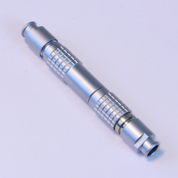
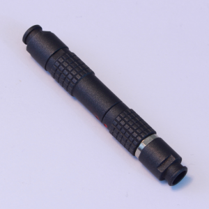
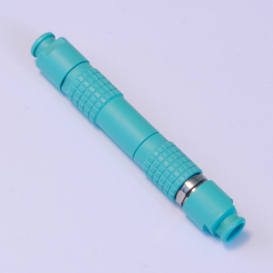

# About Us
Hi, welcome to the Summit Catalog v2!

You will find everything of importance here, including some extras, like information about future Group Buys.  
I am based out of Oregon, United States, and all of my Cable Drops will be in the Pacific time zone.  
I highly suggest joining the Discord, as it’s the best way to interact with the community and learn more.

Thanks!  
-Chris

# Contact Us
* Email: support@summitcables.com
* Instagram: https://instagram.com/summitcables
* Twitter: https://twitter.com/summitcables
* Reddit: https://reddit.com/u/kbnote
* Discord: https://discord.gg/summitcables

# Group Buy Schedule
We are currently using a Google Form which opens up every Saturday at 10:00AM PT (https://time.is/PT) located at [this link to the ordering form](https://docs.google.com/forms/d/e/1FAIpQLScuu3xz-DcRyDlPHUsZB4gOGa9OdQlIf22b8dJHM9YKLoZjvQ/closedform).

Keep in mind that all times are subject to change. In the event of any changes, an announcement will be posted in the Summitcables Discord.

| Nov 9                     | Nov 16      | Nov 23          |
|---------------------------|-------------|-----------------|
| LE Noir R2                | LE Redux    | LE Secret :shh: |
| 3 options + Anything goes | All options | 3 options       |
| 35 units                  | 50 units    | 50 units        |

## Terms of Service
* 7-14 business day turnaround time
* 14 day return policy
* No refunds unless authorized (misorders, rent is due, etc.)

## Base
**Price:** $20.00

**Information:** Base covers 1ft of wire and paracord, heatshrink, and silver USB Type A/Mini B/Micro B connectors.

## Paracord
**Price:** $0.50 per ft (1 ft included in Base)

**Information:** Type III Paracord is the commerical version of Mil Spec 550 Parachute Cord, also known as Mil Spec Paracord, or Mil Spec 550 Paracord. This Nylon 550 cord is smooth and pliable which makes it nice to handle. The high 550lb tensile strength gives it superior strength and durability. It resists rot, mildew, and UV damage

We will be updating this list from time to time, so be on the lookout!

|    **Aloha**                     |    **Apocalypse**                     |    **Banana**                                 |    **Black**                                     |    **Black Widow**                             |
|-----------------------------------------------------|---------------------------------------------------------------|-------------------------------------------------------------------|---------------------------------------------------------------------|-------------------------------------------------------------------------|
|    **Baby Blue**             |    **Blue Blend**                     |    **Blue Carribean**                 |    **Blue Electric**                     |    **Blue Lite Carolina**               |
|    **Blue Midnight**     |    **Blue Royal**                     |    **Blue Snake**                         |    **Breast Cancer Awareness** |    **Brown Chocolate (Espresso)** |
|    **Camo Deep Woods** |    **Canary Yellow**               |    **Canis**                                   |    **Chill**                                     |    **Cotton Candy**                           |
|    **Country Girl**       |    **Coyote Brown**                 |    **Cream**                                   |    **Decay**                                     |    **Explode**                                     |
|    **Fireball**               |    **Gecko**                               |    **Gray**                                     |    **Home Town Hero**                   |    **Infiltrate**                               |
|    **Kelly Green**         |    **Khaki**                               |    **Knights Gold and Black** |    **Lifeguard**                             |    **Lightning**                                 |
|    **Mint Green**           |    **Mint Oreo**                       |    **Neon Green**                         |    **Neon Orange**                         |    **Neon Purple Acid**                   |
|    **Neptune**                 |    **Pink (Pretty in Pink)** |    **Pink Rose**                           |    **Purple**                                   |    **Purple Blend**                           |
|    **Racing Stripe**     |    **Reactor**                           |    **Rebel Camo**                         |    **Red**                                         |    **Red Imperial**                           |
|    **Rorschach**             |    **Silver Gray**                   |    **Smores**                                 |    **Snow Camo**                             |    **Spiral Urban**                           |
|    **Starry Night**       |    **Strawberry Fields**       |    **Sugar Rush**                         |    **Tan**                                         |    **Thin Blue Line**                       |
|    **Turquoise**             |    **UFO**                                   |    **White**                                   |    **Zebra**                                     |                                                                         |

## Techflex
**Price:** $1.00 per ft

**Information:** Techflex, also known as double-sleeving, is a second layer of sleeving which covers the paracord. It adds an extra layer of durability and rigidity to the cable and endless possibilities for color combinations. We always recommend adding Techflex when ordering coiled cables as they keep them cleaner and more durable.

|    **Aqua**               |    **Beige**   |    **Black**           |    **Blue**               |
|---------------------------------------------|-----------------------------------|-------------------------------------------|---------------------------------------------|
|    **Brown**             |    **Carbon** |    **Clear**           |    **Dark Purple** |
|    **Gray**               |    **Green**   |    **Monochrome** |    **Neon Pink**     |
|    **Neon Yellow** |    **Orange** |    **Purple**         |    **Red**                 |
|    **White**             |                                   |                                           |                                             |

## Heatshrink
**Price:** $0.00 (included in base)

**Information:** These strips of color will go on the ends of connectors and between detachables. They are also used in accents.

|    **Black   |    **Blue**                 |    **Brown** |    **Burnt Orange** |
|-----------------------------------|-----------------------------------------------|---------------------------------|-----------------------------------------------|
|    **Clear**               |    **Forest Green** |    **Gray**   |    **Green**               |
|    **Orange** |    **Purple**             |    **Red**     |    **White**               |
|    **Yellow** |                                               |                                 |                                               |

## Host Connector
**Price:**

| Connector:     | Silver                   | Gold  |
|----------------|--------------------------|-------|
| USB Type A 2.0 | $0.00 (included in base) | $0.75 |

This connector plugs into your host, i.e. your computer.

## Device Connector
**Price:**

| Connector:     | Silver                   | Gold  |
|----------------|--------------------------|-------|
| USB Mini B     | $0.00 (included in base) | $0.75 |
| USB Micro B    | $0.00 (included in base) | $0.75 |
| USB Type C 2.0 | $2.00                    | -     |

This connector plugs into your decvice, i.e. your keyboard or phone.

## Coil
* 4 in coil (covers 3 ft of cable)
  * **Price:** $5.00
* 5 in coil (covers 4 ft of cable)
  * **Price:** $6.00
* 6 in coil (covers 5 ft of cable)
  * **Price:** $7.00
* 7 in coil (covers 6 ft of cable)
  * **Price:** $8.00
* 8 in coil (covers 7 ft of cable)
  * **Price:** $9.00

## Detachable
**Price:**

| Type:     | Silver | CE     | LE     | SE     |
|-----------|--------|--------|--------|--------|
| Aviator   | $11.00 | $20.00 | $20.00 | $20.00 |
| Push-Pull | TBA    | TBA    | TBA    | TBA    |

Detachable connectors functionally allow for ease and flow when interchanging USB connectors, while also preserving the lifespan of your USB cable’s receptacle and looking extremely cool on your desk.

The **Collector’s Edition series**, also known as the **CE-series**, is a range of always in-stock colored detachables. CE detachables will be offered every group buy.

The **Limited Edition series**, also known as the **LE-series**, is a range of very rare colored detachables. LE detachables are limited in stock and will only be offered once, or in some rare cases, every few months. 

The **Special Edition series**, also known as the **SE-series**, is a range of collaborated colored detachables only made possible due to partnerships made with other vendors within the mechanical keyboard community. SE detachables will only be offered once during special group buys.

All colored detachables are unique to and only obtainable through Summitcables.

### Aviator
|    **Silver**                     |    **CE Beige**                   |    **CE Blue Gray**     |    **CE Crimson Red** |
|-----------------------------------------------------|-------------------------------------------------------|-------------------------------------------------|-------------------------------------------------|
|    **CE Everest White** |    **CE Gunmetal Gray**   |    **CE Hot Pink**       |    **CE Raven Black** |
|    **CE Royal Purple**   |    **CE Sakura**                 |    **CE Sky Blue**       |    **LE Dark Matter** |
|    **LE Galaxy**               |    **LE Ghost**                   |    **LE Glacier**         |    **LE Noir**               |
|    **LE Olive**                 |    **LE Pink Champagne** |    **LE Wild Purple** |    **LE Yolch**             |

### Push-Pull
|    **Silver** |    **CE Gunmetal Gray** |    **LE Glacier** |
|-----------------------------------|-------------------------------------------------------|-------------------------------------------|

## Accents
**Price:** $3.50

**Information:** Accents are colored stripes made out of heatshrink that are attached on your detachable.

|    **Black**   |    **Blue**                 |    **Brown** |    **Burnt Orange** |
|-----------------------------------|-----------------------------------------------|---------------------------------|-----------------------------------------------|
|    **Clear**               |    **Forest Green** |    **Gray**   |    **Green**               |
|    **Orange** |    **Purple**             |    **Red**     |    **White**               |
|    **Yellow** |                                               |                                 |                                               |

## Extra Ends
**Price:**

| Detachable: | Silver  | Colored |
|-------------|---------|---------|
| Aviator     | $21.00  | $26.00  |
| Push-Pull   | TBA     | TBA     |

Extra ends cover 5 in of wire and paracord, heatshrink, regular connector, and female detachable.

## Shipping
**Price:**

| Shipping:        | USPS First Class | USPS First Class (>8oz) |
|------------------|------------------|-------------------------|
| USA, Puerto Rico | $3.79            | $4.00                   |
| Canada           | $10.00           | $10.00                  |
| International    | $14.00           | $22.50                  |