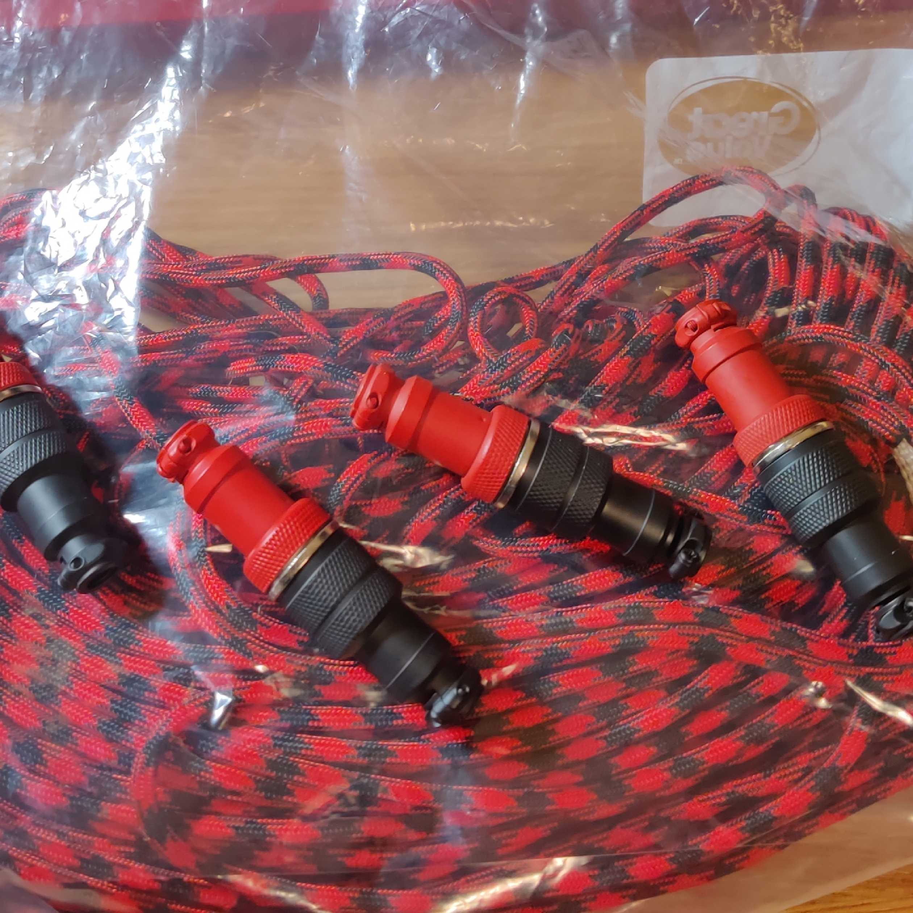
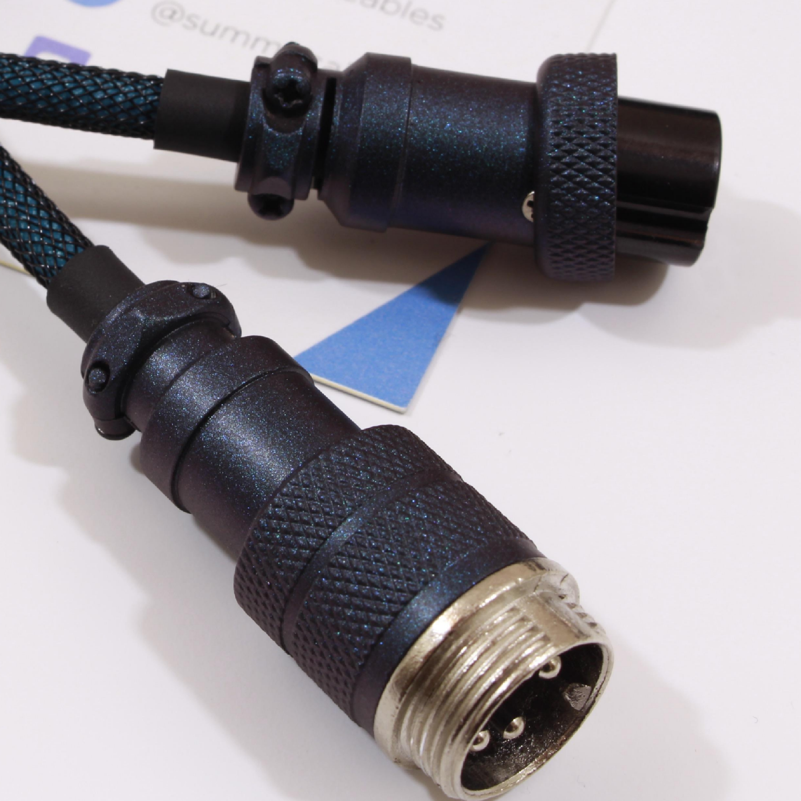
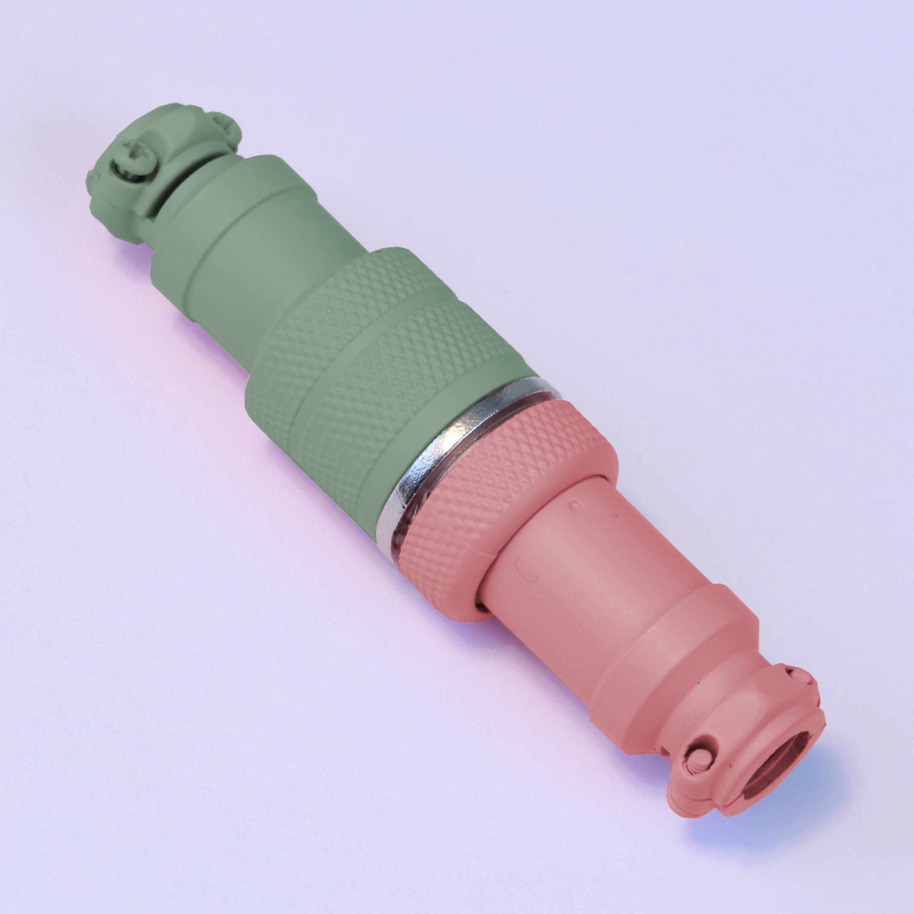

# Previous LE Releases

## LE Dracula
- December 7th, 2019
- November 30th, 2019

{:height="50%" width="50%"}

## LE Glacier
- December 7th, 2019
- November 2nd, 2019
- October 5th, 2019

{:height="50%" width="50%"}

## LE Blackwidow
- November 23rd, 2019

{:height="50%" width="50%"}

## LE Noir
- November 9th, 2019
- September 28th, 2019

{:height="50%" width="50%"}

## LE Nebula
- November 2nd, 2019

{:height="50%" width="50%"}

## LE Pink Rose Gold
- November 2nd, 2019

{:height="50%" width="50%"}

## LE 9009
- October 26th, 2019

{:height="50%" width="50%"}

## LE Galaxy
- October 19th, 2019

{:height="50%" width="50%"}

## LE Dark Matter
- October 12th, 2019

{:height="50%" width="50%"}

## LE Pink Champagne
- September 21st, 2019

{:height="50%" width="50%"}

## LE Olive
- September 21st, 2019

{:height="50%" width="50%"}

## LE Yolch
- September 21st, 2019

{:height="50%" width="50%"}

## LE Wild Purple
- September 21st, 2019

{:height="50%" width="50%"}
